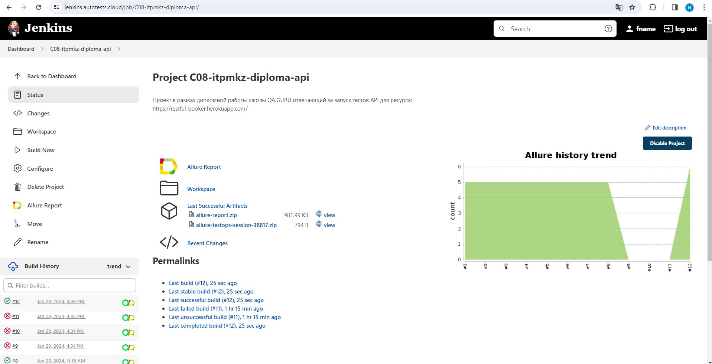
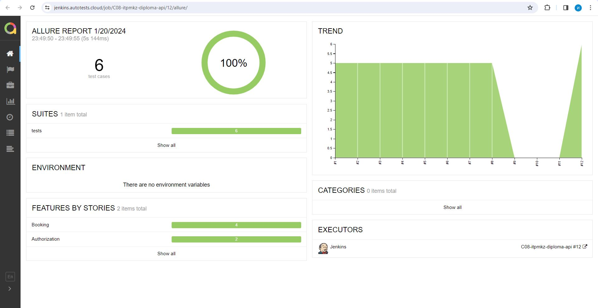
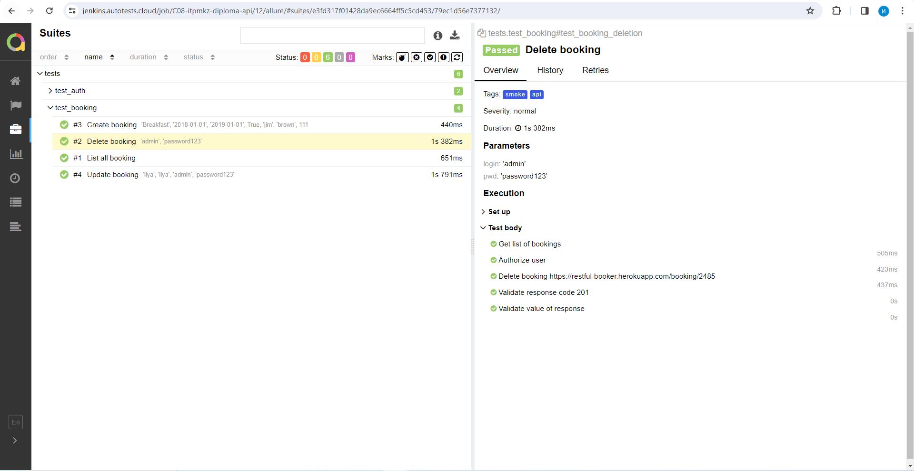
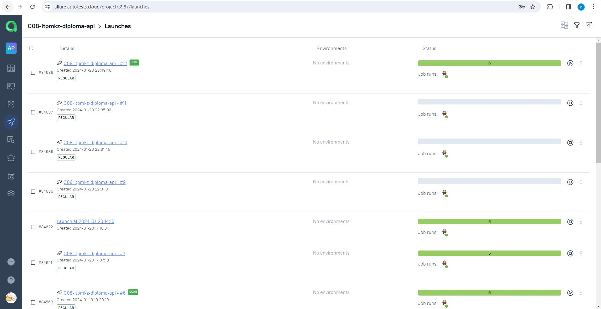
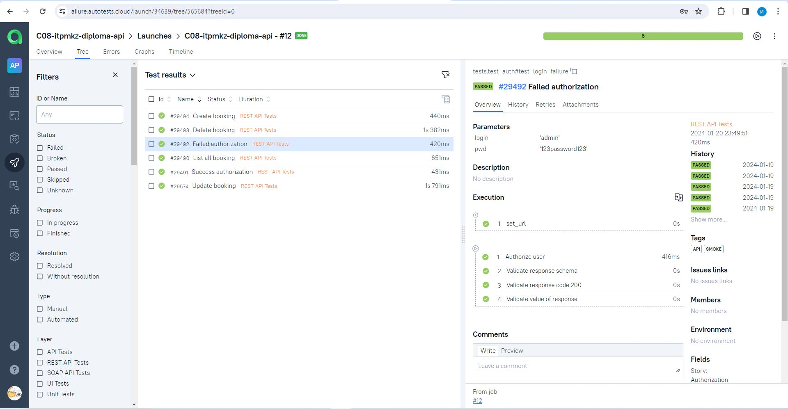
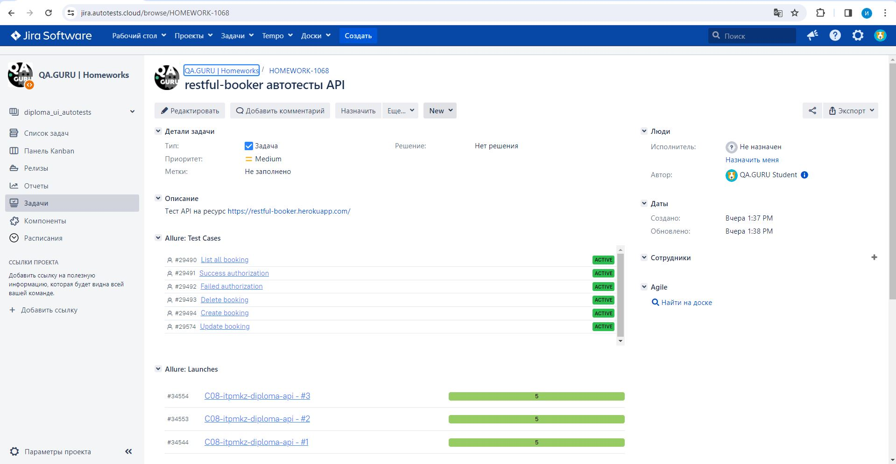
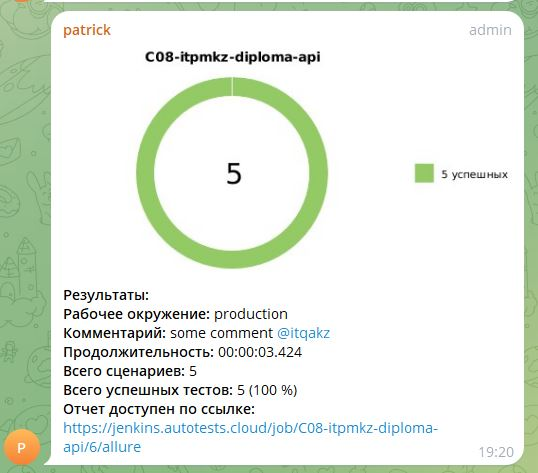

# Фреймворк для автоматизации тестирования API Restful-Booker
> <a target="_blank" href="https://restful-booker.herokuapp.com/apidoc/index.html">API документация</a>

----

----
> ### Особенности проекта

* Оповещения о тестовых прогонах в Telegram
* Проверки выполнены на request body, response body, status code
* Валидация Pydantic
* Сборка проекта в Jenkins
* Отчеты Allure Report
* Интеграция с Allure TestOps
* Автоматизация отчетности о тестовых прогонах и тест-кейсах в Jira

### Список проверок, реализованных в автотестах
- [x] Успешная и неуспешная авторизации
- [x] Получение списка броней
- [x] Удаление брони
- [x] Создание новой брони
- [x] Редактирование существующей брони

----

### Используемый стэк

           

----

### Локальный запуск автотестов

#### Для запуска автотестов выполнить в cli:
```bash
python -m venv .venv
source .venv/bin/activate
pip install -r requirements.txt
pytest .
```

#### Генерация отчёта:
```bash
allure serve 
```
----
### Проект в Jenkins
   
#### Проект
> <a target="_blank" href="https://jenkins.autotests.cloud/job/C08-itpmkz-diploma-api/">Ссылка</a>

#### Запуск автотестов в Jenkins
Является параметризированным. На выбор доступны параметры, описанные выше.
Для запуска достаточно:
1. Открыть проект
2. Нажать "Build Now"

Сопроводительный скриншот:


----
### Allure отчет
Пример выполнения Allure отчета доступен по ссылке:
> <a target="_blank" href="https://jenkins.autotests.cloud/job/C08-itpmkz-diploma-api/5/allure/">Ссылка</a>

Отчет:


Детали:



----
### Интеграция с Allure TestOps
Пример интеграции доступен по ссылке:
> <a target="_blank" href="https://allure.autotests.cloud/project/3987/launches">Ссылка</a>

Запуск тестовых прогонов:


Детали тестового прогона:


----
### Интеграция с Jira
> <a target="_blank" href="https://jira.autotests.cloud/browse/HOMEWORK-1068">Ссылка</a>

Тикет:


----
### Оповещения в Telegram

